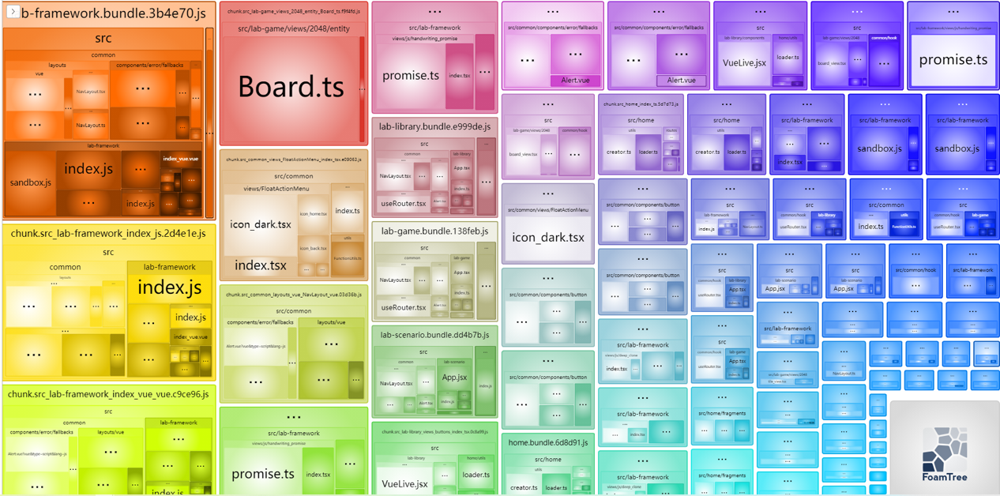

# Guide
# TAGS

| TAGS  |   |
|---|---|
| [🧻maintain]  | system/configs/framework update |
| [🌈beautify]  | beautify interface              |
| [⚒️fix]       | fix bugs                        |
| [🎉feat]      | add new pages                   |
| [⚡boost]     | make things better              |
| [🌟upgrade]   | add new feature in framework    |
| [🍕addon]     | add new to list                 |

# Code Spliting in Webpack 5

```
hidding general vendors
```
Setting `entry.dependencies`[(document)](entry) to generate vendors

https://github.com/Astroleander/weboratory2/blob/b5fcf5550c0824ed5a767a0dc154e7edc7c96af2/configs/webpack.config.js#L15-L29

